# Seneca - Project Overview Document

> **Decentralized Payroll on XRP Ledger** – A full-stack payroll management system enabling employers to pay salaries in XRP or RLUSD with seamless time tracking and approval workflows.

---

## 1. Project Summary

**Seneca** is a decentralized payroll management platform that bridges traditional workforce management with cryptocurrency payments on the XRP Ledger. Employees track their work hours with an intuitive 3-button interface (Work/Rest/End), submit payment applications, and receive their salaries in XRP or RLUSD – the stablecoin issued by Ripple.

### Elevator Pitch

*"Seneca transforms payroll from a monthly wait into an on-demand crypto payment. Track time, get approved, receive XRP or RLUSD – all within seconds, not weeks."*

---

## 2. Problem Statement

### The Real-World Problem

Traditional payroll systems suffer from several critical pain points:

| Problem | Impact |
|---------|--------|
| **Delayed Payments** | Workers often wait 2-4 weeks for paychecks, creating financial stress |
| **Cross-Border Friction** | International payments incur high fees (3-7%) and take 3-5 business days |
| **Lack of Flexibility** | Employees can't choose when or how to receive their earnings |
| **Centralized Intermediaries** | Banks and payment processors add complexity and costs |
| **Currency Volatility Risk** | Remote workers in USD-based contracts face local currency depreciation |

### Why Is This Important?

The gig economy and remote work have exploded globally. According to the World Bank, remittance fees average 6.2% globally. For a $500 payment, that's $31 lost to intermediaries. Workers in developing economies are particularly affected, often receiving payments days late due to banking infrastructure limitations.

**Seneca addresses these issues by enabling:**
- **Instant settlements** (3-5 seconds via XRPL)
- **Minimal fees** (~$0.0002 per transaction)
- **Stablecoin option** (RLUSD) for volatility protection
- **On-demand payments** when employees choose

---

## 3. Solution

Seneca provides an end-to-end solution for crypto-based payroll:

### For Employers (Admins)
- Create organizations and invite employees
- Configure wallet settings (Hot Wallet or GemWallet)
- Review and approve time applications
- Execute payments in XRP or RLUSD with one click

### For Employees (Workers)
- Simple time tracking with Work/Rest/End buttons
- Submit payment applications (single, batch, or period-based)
- Register multiple wallet addresses
- Receive salary in preferred cryptocurrency at any time

### How XRP/RLUSD and GemWallet Fit In

```mermaid
flowchart LR
    subgraph Worker["👷 Worker"]
        TT[Time Tracking<br/>Work / Rest / End]
    end

    subgraph App["📱 Seneca"]
        Apply[Payment<br/>Application]
        Approval[Admin<br/>Approval]
        Rate[Exchange Rate<br/>Fetch]
    end

    subgraph Payment["💰 Payment Execution"]
        Choice{Currency<br/>Choice}
        XRP[XRP Payment]
        RLUSD[RLUSD Payment]
    end

    subgraph Wallet["🔐 Signing Method"]
        GW[GemWallet<br/>Manual Sign]
        HW[Hot Wallet<br/>Auto Sign]
    end

    subgraph XRPL["⛓️ XRP Ledger"]
        Submit[Submit<br/>Transaction]
        Confirm[Confirmation<br/>3-5 sec]
    end

    TT --> Apply
    Apply --> Approval
    Approval --> Rate
    Rate --> Choice
    Choice -->|XRP| XRP
    Choice -->|RLUSD| RLUSD
    XRP --> GW
    XRP --> HW
    RLUSD --> GW
    GW --> Submit
    HW --> Submit
    Submit --> Confirm
    Confirm -->|Receive| Worker
```



---

## 4. XRPL Features Used

Seneca effectively leverages multiple XRP Ledger capabilities:

| Feature | Usage in Seneca |
|---------|---------------------|
| **Native XRP Payments** | Direct salary payments in XRP drops |
| **Issued Currency (RLUSD)** | Stablecoin payments for volatility protection |
| **Trustlines** | Required for RLUSD transactions; validated before payment |
| **Transaction Memos** | Audit trail with SHA256 data hashes |
| **GemWallet Integration** | Non-custodial browser wallet for secure signing |
| **Dual Network Support** | Testnet for development, Mainnet for production |

> **Technical Details**: See [TECHNICAL.md](./TECHNICAL.md) for implementation details, code examples, and architecture diagrams.

### 4.1 Transaction Memos and Data Verification

Seneca leverages XRPL's transaction memo feature to create an immutable audit trail that links blockchain transactions to internal payment records.

#### How It Works

When a payment is executed, Seneca generates a SHA256 hash of the payment data and stores it in the XRPL transaction memo field:


#### Payment Data Hash Structure

The hash is computed from the following payment information:

| Field | Description |
|-------|-------------|
| `paymentId` | Unique payment identifier in Seneca |
| `workerId` | Worker receiving the payment |
| `amount` | Payment amount (in USD) |
| `cryptoAmount` | Crypto amount sent (XRP or RLUSD) |
| `cryptoType` | Currency type (XRP or RLUSD) |
| `exchangeRate` | Rate at time of payment |
| `timestamp` | ISO 8601 timestamp |

#### Transaction Memo Format

```json
{
  "MemoType": "payment_hash",
  "MemoData": "sha256:a1b2c3d4e5f6..."
}
```

The memo is hex-encoded per XRPL specification and stored permanently on the ledger.

#### Searching Payment Data by Hash

Users can search for payment records using the hash value from any XRPL transaction:

1. **View Transaction on XRPL Explorer** – Find the transaction hash
2. **Extract MemoData** – Copy the SHA256 hash from the memo
3. **Search in Seneca** – Use the hash to retrieve the original payment details


#### Benefits

| Benefit | Description |
|---------|-------------|
| **Immutable Proof** | Hash on XRPL cannot be altered after transaction |
| **Data Integrity** | Any change to payment data would produce a different hash |
| **Privacy** | Only the hash is public; actual data stays in Seneca |
| **Audit Trail** | Employers and workers can verify payment authenticity |
| **Dispute Resolution** | Blockchain-backed proof of payment terms |

#### Use Cases

- **Tax Audits**: Provide verifiable proof of payment amounts and dates
- **Dispute Resolution**: Prove exact payment terms recorded at transaction time
- **Compliance**: Demonstrate immutable record-keeping for regulatory requirements
- **Reconciliation**: Match XRPL transactions to internal accounting records

---

## 5. User Flow / How It Works

### Complete User Journey

```mermaid
sequenceDiagram
    participant W as Worker
    participant App as Seneca
    participant A as Admin
    participant GW as GemWallet
    participant XRPL as XRP Ledger

    Note over W,XRPL: 1. SETUP PHASE
    A->>App: Create Organization
    A->>App: Configure Wallet (GemWallet/Hot)
    A->>App: Invite Worker

    Note over W,XRPL: 2. TIME TRACKING
    W->>App: Clock In (Work)
    W->>App: Take Break (Rest)
    W->>App: Clock Out (End)

    Note over W,XRPL: 3. PAYMENT APPLICATION
    W->>App: Select worked days
    W->>App: Submit Application
    App->>App: Calculate salary (hours × rate)

    Note over W,XRPL: 4. APPROVAL
    A->>App: Review Application
    A->>App: Approve

    Note over W,XRPL: 5. PAYMENT EXECUTION
    W->>App: Request Payment (XRP/RLUSD)
    App->>App: Fetch exchange rate
    App->>GW: Create transaction
    GW->>A: Show signing popup
    A->>GW: Approve & Sign
    GW->>XRPL: Submit transaction
    XRPL-->>W: Receive crypto (3-5 sec)
```



### Step-by-Step Guide

#### For Workers

1. **Register** – Accept invitation email, set password
2. **Track Time** – Click Work to start, Rest for breaks, End to finish
3. **Apply for Payment** – Select completed work periods, submit application
4. **Receive Payment** – After approval, choose XRP or RLUSD, receive instantly

#### For Admins

1. **Setup Organization** – Create organization, connect GemWallet
2. **Invite Workers** – Send email invitations with hourly rates
3. **Approve Applications** – Review time logs, approve or reject
4. **Execute Payments** – Sign transactions via GemWallet

---

## 6. Demo

### Live Demo

🔗 **[Demo Application](https://seneca.vercel.app)** (Testnet)

### Screenshots

#### Worker Dashboard - Time Tracking
```
┌────────────────────────────────────────────────────────┐
│  Seneca                            [John Smith ▼]  │
├────────────────────────────────────────────────────────┤
│                                                        │
│     Current Status: WORKING                            │
│     Started: 9:00 AM                                   │
│     Duration: 3h 45m                                   │
│                                                        │
│   ┌──────────┐  ┌──────────┐  ┌──────────┐            │
│   │  WORK    │  │   REST   │  │   END    │            │
│   │  (Active)│  │          │  │          │            │
│   └──────────┘  └──────────┘  └──────────┘            │
│                                                        │
│  Today's Log:                                          │
│  • 9:00 AM - Work Started                              │
│  • 12:00 PM - Rest (Lunch)                             │
│  • 1:00 PM - Work Resumed                              │
│                                                        │
└────────────────────────────────────────────────────────┘
```

#### Admin Dashboard - Payment Approval
```
┌────────────────────────────────────────────────────────┐
│  Seneca Admin                    [GemWallet: ✓]    │
├────────────────────────────────────────────────────────┤
│                                                        │
│  Pending Payments (3)                                  │
│  ┌──────────────────────────────────────────────────┐  │
│  │ John Smith         │ $450.00 │ 18h work │ XRP    │  │
│  │ Jan 1-15, 2026     │ ≈ 180 XRP @ $2.50  │        │  │
│  │ [✓ Approve] [✗ Reject]                   │        │  │
│  └──────────────────────────────────────────────────┘  │
│  ┌──────────────────────────────────────────────────┐  │
│  │ Jane Doe           │ $800.00 │ 32h work │ RLUSD  │  │
│  │ Jan 1-15, 2026     │ 800 RLUSD           │        │  │
│  │ [✓ Approve] [✗ Reject]                   │        │  │
│  └──────────────────────────────────────────────────┘  │
│                                                        │
└────────────────────────────────────────────────────────┘
```

### Demo Video

📹 **[Watch Demo Video](https://youtube.com/watch?v=DEMO_VIDEO_ID)** *(To be uploaded)*

---

## 7. GitHub Repository

🔗 **[https://github.com/YOUR_USERNAME/seneca](https://github.com/YOUR_USERNAME/seneca)**

The repository is publicly accessible and includes:
- Complete source code
- Database schemas (PostgreSQL + TimescaleDB)
- Docker development environment
- Comprehensive documentation

---

## 8. Why XRP Ledger?

We chose XRP Ledger over other blockchains for specific reasons that align with payroll requirements:

### Comparison with Alternatives

| Criteria | XRP Ledger | Ethereum | Bitcoin | Solana |
|----------|------------|----------|---------|--------|
| **Settlement Time** | 3-5 sec ✓ | 12-15 min | 10-60 min | 0.4 sec |
| **Transaction Fee** | ~$0.0002 ✓ | $1-50+ | $1-20+ | $0.00025 |
| **Native Stablecoin** | RLUSD ✓ | USDC/USDT | - | USDC |
| **Energy Efficiency** | Carbon-neutral ✓ | PoS (improved) | High energy | Moderate |
| **Regulatory Clarity** | Improving ✓ | Uncertain | Uncertain | Uncertain |

### Key Advantages for Payroll

1. **Speed** – 3-5 second finality means employees see funds almost instantly
2. **Cost** – Negligible fees make micro-payments viable (daily or per-task payments)
3. **RLUSD** – Ripple's stablecoin eliminates XRP volatility concerns for salary payments
4. **Scalability** – 1,500+ TPS handles enterprise payroll volumes
5. **Decentralization** – No single point of failure; payments process 24/7
6. **Green** – Carbon-neutral blockchain aligns with ESG requirements

---

## 9. Scalability & Real-World Impact

### Potential Scale

| Metric | Conservative | Moderate | Optimistic |
|--------|--------------|----------|------------|
| **Organizations** | 100 | 1,000 | 10,000 |
| **Workers per Org** | 50 | 100 | 200 |
| **Payments per Month** | 5,000 | 100,000 | 2,000,000 |
| **XRPL Transactions/Day** | ~170 | ~3,300 | ~67,000 |

### Transaction Volume Estimate

Assuming moderate adoption:
- **100,000 monthly payments** → ~3,300 XRPL transactions/day
- Average payment: $500 → **$50M monthly volume on XRPL**
- Transaction fees: ~$6.60/month total (vs. $3.1M via traditional banking at 6.2%)

### Real-World Use Cases

1. **Remote Tech Teams** – Developers worldwide paid in RLUSD
2. **Gig Platforms** – Instant payment upon task completion
3. **Freelance Marketplaces** – On-demand withdrawals
4. **International Contractors** – Bypass SWIFT delays and fees
5. **DAO Contributor Payments** – Decentralized organization payroll

### Broader Adoption Potential

- **Integration with HR Systems** – API for Workday, BambooHR, etc.
- **Mobile App** – iOS/Android for workers
- **Multi-Currency Support** – Additional XRPL tokens
- **Smart Contract Automation** – Automatic payments on approval

---

## 10. Use Cases

Seneca is designed to address real-world payroll challenges across various industries and scenarios.

### 10.1 Multinational Remote Teams

**Scenario**: A US-based tech company employs developers across 10 countries.

| Traditional Approach | Seneca Approach |
|---------------------|---------------------|
| SWIFT transfers: $30-50 fee per payment | XRPL transaction: ~$0.0002 |
| 3-5 business days settlement | 3-5 seconds settlement |
| Bank account required in each country | Only wallet address needed |
| Currency conversion fees (2-4%) | Direct USD value via RLUSD |

**Cost Savings Example** (50 employees, monthly):
- Traditional: $2,500/month in fees
- Seneca: < $1/month

### 10.2 Gig Economy & Freelance Platforms


**Applicable Platforms**:
- Translation & Localization services
- Design marketplaces (logo, UI/UX)
- Code review & development tasks
- Content creation & writing
- Virtual assistance

**Benefit**: Workers receive payment immediately upon task approval, eliminating the typical 2-4 week payment cycle.

### 10.3 DAO & Web3 Organizations

| Organization Type | Use Case |
|-------------------|----------|
| **DeFi Protocols** | Core developer salaries |
| **NFT Projects** | Artist & moderator compensation |
| **Gaming Guilds** | Player reward distribution |
| **Open Source Projects** | Contributor grants |

**Advantage**: Native integration with crypto-first organizations that already operate with wallets.

### 10.4 Emerging Markets & Unbanked Workers

**Target Regions**:
- **Argentina**: Hyperinflation (100%+/year) → RLUSD preserves USD value
- **Nigeria**: 45% bank account penetration → Wallet-only receiving
- **Philippines**: High remittance volume → Instant, low-fee transfers
- **Venezuela**: Currency instability → Stable USD-pegged payments


### 10.5 Seasonal & Project-Based Work

| Industry | Scenario | Benefit |
|----------|----------|---------|
| **Agriculture** | Harvest season workers | Daily/weekly pay at near-zero cost |
| **Events** | Festival & conference staff | Payment on event completion |
| **Construction** | Project-based contractors | Milestone-based payments |
| **Tourism** | Seasonal guides | Flexible payment timing |

### 10.6 Creator Economy & MCN

**Multi-Channel Networks (MCN)** can use Seneca to:
- Distribute revenue shares to YouTubers/Streamers
- Pay content creators on performance metrics
- Handle cross-border payments to global talent roster

### 10.7 International NGOs & Aid Organizations

| Challenge | Solution |
|-----------|----------|
| Conflict zone banking restrictions | No bank infrastructure needed |
| High remittance fees eating into aid | Near-zero transaction costs |
| Local currency instability | USD-pegged RLUSD |
| Audit trail requirements | Blockchain transparency |

---

## 11. Legal & Regulatory Considerations

### 11.1 Challenges by Jurisdiction

Seneca operates at the intersection of employment law, tax law, and cryptocurrency regulation. Each jurisdiction presents unique challenges:

#### Tax Law Considerations

| Country | Crypto Tax Treatment | Employer Obligation | Employee Obligation |
|---------|---------------------|---------------------|---------------------|
| **United States** | Taxable as property | Report as wages (W-2/1099) | Report as income at FMV |
| **Japan** | Miscellaneous income | Withhold if applicable | Self-report crypto gains |
| **Germany** | Tax-free if held >1 year | Report employment income | Declare if sold within 1 year |
| **Singapore** | No capital gains tax | Report as employment income | Generally tax-free |
| **UK** | Capital gains + Income tax | PAYE on FMV at payment | Report disposal gains |

#### Labor Law Considerations

| Region | Key Regulations | Seneca Compliance |
|--------|-----------------|----------------------|
| **EU** | Working Time Directive | Time tracking with Work/Rest/End |
| **US** | FLSA (Fair Labor Standards Act) | Hourly rate tracking, overtime calculation |
| **Japan** | Labor Standards Act | Accurate time records, break tracking |
| **Australia** | Fair Work Act | Award rates, penalty rates support |

### 11.2 How Seneca Addresses Compliance

```mermaid
flowchart TB
    subgraph Recording["📊 Record Keeping"]
        TT[Time Tracking<br/>Work/Rest/End]
        RATE[Hourly Rate<br/>in USD]
        XRATE[Exchange Rate<br/>at Payment]
    end

    subgraph Export["📄 Export for Compliance"]
        CSV[CSV Export]
        PDF[PDF Reports]
        API[Accounting API]
    end

    subgraph Reporting["🏛️ Tax Reporting"]
        EMP[Employer Filing<br/>Local Tax Authority]
        WRK[Employee Filing<br/>Individual Tax Return]
    end

    Recording --> Export
    Export --> Reporting
```



### 11.3 Tax Compliance Solution

**Key Principle**: Seneca provides **records and data** for tax compliance; **actual tax filing remains the responsibility of each party** according to their local laws.

#### For Employers

1. **Record USD Value**: All payments are recorded in USD at the time of transaction
2. **Exchange Rate Documentation**: The XRP/USD or RLUSD/USD rate is stored with each payment
3. **Export Functions**: Generate reports compatible with accounting software
4. **Transaction Hashes**: Blockchain proof of payment for audit purposes

#### For Employees

1. **Payment History**: Complete record of all received payments with timestamps
2. **Fair Market Value**: USD value at receipt time for tax reporting
3. **Transaction Proof**: XRPL transaction hash for verification
4. **Export Options**: Download payment history for tax filing

### 11.4 Recommended Compliance Workflow


### 11.5 Country-Specific Notes

#### United States
- **Employer**: Must report wages on W-2 (employee) or 1099 (contractor) using USD FMV
- **Employee**: Report as ordinary income; crypto-to-fiat conversion is separate taxable event
- **Seneca Support**: USD value recorded at payment time for IRS compliance

#### Japan
- **Employer**: Withhold income tax if applicable under employment contract
- **Employee**: Report as 雑所得 (miscellaneous income) at year-end tax filing
- **Seneca Support**: JPY conversion rate export for 確定申告 (tax return)

#### European Union
- **Employer**: Follow local employment law; crypto payments may require FMV reporting
- **Employee**: Tax treatment varies by country (Germany, France, Netherlands differ)
- **Seneca Support**: Multi-currency export with EUR/USD rates

#### Emerging Markets
- **General**: Many countries have evolving crypto regulations
- **Recommendation**: Consult local tax professional
- **Seneca Support**: Complete transaction history with blockchain verification

### 11.6 Disclaimer

> **Important**: Seneca is a **payroll management tool**, not a tax advisory service. Users are responsible for:
> - Understanding and complying with local tax laws
> - Consulting qualified tax professionals
> - Filing accurate tax returns
> - Maintaining proper documentation
>
> Seneca provides the **data and records** needed for compliance, but does not provide tax advice or file taxes on behalf of users.

### 11.7 Future Compliance Features

| Feature | Status | Description |
|---------|--------|-------------|
| Multi-jurisdiction tax templates | Planned | Pre-configured reports for major countries |
| Accounting software integration | Planned | QuickBooks, Xero, freee API |
| Automated FMV calculation | Planned | Real-time rate at payment execution |
| Audit log export | Available | Complete transaction history with hashes |

---

## 12. Team

| Name | Role | Background |
|------|------|------------|
| **[Your Name]** | Full-Stack Developer | Next.js, React, Blockchain |
| **[Team Member 2]** | Backend Developer | Node.js, PostgreSQL, XRPL |
| **[Team Member 3]** | UI/UX Designer | Product Design, Fintech |

### Contact

- Email: team@seneca.io
- Twitter: [@Seneca](https://twitter.com/Seneca)
- Discord: [Seneca Community](https://discord.gg/seneca)

---

## 13. Prior Work Disclosure

The following components were developed before the hackathon:

| Component | Status | Description |
|-----------|--------|-------------|
| **Next.js Boilerplate** | Pre-existing | Basic project structure with App Router |
| **Authentication Flow** | Pre-existing | NextAuth v5 configuration |
| **Database Schemas** | Pre-existing | Initial Prisma models |
| **UI Components** | Pre-existing | TailwindCSS utility components |

### Work Completed During Hackathon

- ✅ XRPL integration (xrpl.js v4.2.2)
- ✅ GemWallet connection and signing
- ✅ RLUSD payment support with trustline validation
- ✅ Payment workflow (request → approve → execute)
- ✅ Exchange rate integration (CoinGecko)
- ✅ Multi-network support (Testnet/Mainnet)
- ✅ Time application approval system
- ✅ Worker crypto address management

> **Technical Details**: See [TECHNICAL.md](./TECHNICAL.md) for third-party libraries and licenses.

---

## 14. Future Roadmap

### Phase 1: Post-Hackathon (Q1 2026)

- [ ] Mobile app (React Native)
- [ ] Email notifications for payment events
- [ ] CSV/PDF export for tax reporting

### Phase 2: Beta Launch (Q2 2026)

- [ ] Multi-organization dashboard
- [ ] Role-based permissions (Manager, Accountant, etc.)
- [ ] Integration with accounting software (QuickBooks, Xero)
- [ ] Scheduled recurring payments

### Phase 3: Production (Q3 2026)

- [ ] Enterprise API for HR system integration
- [ ] SOC 2 compliance audit
- [ ] Multi-currency support (additional XRPL tokens)
- [ ] Smart contract-based escrow for dispute resolution

### Phase 4: Scale (Q4 2026+)

- [ ] White-label solution for payroll providers
- [ ] DAO treasury management integration
- [ ] Cross-chain support (EVM compatibility layer)

### XRPL Grants Consideration

We plan to apply for **XRPL Grants** to fund:
1. Mobile app development
2. Security audit
3. Enterprise pilot programs
4. Developer documentation and SDK

---

## Summary

**Seneca** transforms payroll by combining:

- 📊 **Simple time tracking** with Work/Rest/End
- ✅ **Approval workflows** for accountability
- 💰 **Instant crypto payments** via XRP Ledger
- 🔒 **Secure signing** with GemWallet
- 💵 **Stablecoin option** with RLUSD

**We believe XRP Ledger is the ideal foundation for the future of payroll.**

---

*Built with ❤️ for HAKS 2026*

🔗 📁 [GitHub](https://github.com/masatojupyter/seneca) | 📹 <a href="https://www.youtube.com/watch?v=CPp9uZXumJU" target="_blank" rel="noopener noreferrer">Video Demo</a> - Watch the demo video
