# Seneca - Technical Documentation

> A decentralized payroll management system powered by XRP Ledger, enabling seamless crypto salary payments with XRP and RLUSD.

## Overview

**Senecas a full-stack web application that revolutionizes payroll management by integrating cryptocurrency payments through the XRP Ledger. It provides a complete workflow from employee time tracking to crypto salary disbursement, supporting both XRP and RLUSD (Ripple USD stablecoin).

### Key Features

- **Simple Time Tracking**: Work/Rest/End button interface for intuitive clock-in/out
- **Flexible Application System**: Single, batch, or period-based payment applications
- **Approval Workflow**: Administrator review and approval process
- **Multi-Crypto Payments**: Support for both XRP and RLUSD
- **GemWallet Integration**: Secure browser-based wallet connection for manual signing
- **Dual Network Support**: Works on both Testnet and Mainnet

---

## Technology Stack

| Category | Technology | Purpose |
|----------|------------|---------|
| **Framework** | Next.js 15 (App Router) | Full-stack web framework |
| **Frontend** | React 19, TailwindCSS 4 | UI components and styling |
| **Authentication** | NextAuth v5 (Auth.js) | JWT-based session management |
| **ORM** | Prisma | Database abstraction |
| **Main Database** | PostgreSQL (Supabase) | Users, organizations, settings |
| **Time-Series DB** | TimescaleDB | Timestamps, exchange rates, audit logs |
| **Blockchain** | xrpl.js v4.2.2 | XRP Ledger integration |
| **Wallet** | @gemwallet/api | Browser wallet connection |
| **Email** | Nodemailer | Notification emails |
| **Hosting** | Vercel | Deployment platform |

---

## System Architecture


### Directory Structure

```
src/
  app/                    # Next.js App Router (thin layer)
  lib/
    client/
      features/           # Feature-based modules (Bulletproof React)
        auth/             # Authentication
        wallet/           # Wallet management
        payment-request/  # Payment requests
        ...
      hooks/              # Shared React hooks
      context/            # React Context providers
    server/
      use_case/           # Business logic (Clean Architecture)
      gateway/            # External service abstractions
      repository/         # Data access layer
      infra/              # Concrete implementations
      errors/             # Custom error classes
    shared/
      entity/             # Shared type definitions
```

---

## Architecture Deep Dive

Senecapts a hybrid architecture combining **Bulletproof React** on the client side with **Clean Architecture** on the server side, connected through Next.js Server Actions.

### Layered Architecture Overview


### Client-Side Architecture (Bulletproof React)

The client follows a **feature-first** organization where each feature is a self-contained module.


### Server-Side Architecture (Clean Architecture)

The server follows **Clean Architecture** principles with clear separation of concerns.


### Dependency Flow


### Request Flow Example: Payment Execution


### Database Architecture


### Security Architecture


### Error Handling Strategy


### Scalability Considerations


---

## User Roles & Workflows

### Participants

| Role | Description |
|------|-------------|
| **Admin** | Organization owner. Manages employees, approves applications, executes payments |
| **Worker** | Employee. Records work time, submits applications, receives crypto payments |

> **Note**: The same person can have both Admin and Worker accounts using the same email address.

---

## Core Workflow


---

## XRP Ledger Integration

### Supported Networks

| Network | WebSocket Endpoint | Use Case |
|---------|-------------------|----------|
| **Testnet** | `wss://s.altnet.rippletest.net:51233` | Development & Testing |
| **Mainnet** | `wss://xrplcluster.com` | Production |

### Supported Currencies

#### XRP (Native Currency)
- Native asset on XRP Ledger
- Amount specified in **drops** (1 XRP = 1,000,000 drops)
- No trustline required

#### RLUSD (Ripple USD Stablecoin)
- Issued currency on XRP Ledger
- Amount specified in currency units (6 decimal precision)
- **Requires trustline** from recipient


### Payment Transaction Flow


### XRPL Code Examples

#### XRP Payment
```typescript
const payment: Payment = {
  TransactionType: 'Payment',
  Account: wallet.classicAddress,
  Destination: toAddress,
  Amount: amountDrops,  // e.g., "1000000" for 1 XRP
};

const result = await client.submitAndWait(payment, {
  autofill: true,
  wallet,
});
```

#### RLUSD Payment
```typescript
const rlusdAmount: IssuedCurrencyAmount = {
  currency: 'RLUSD',
  issuer: issuerAddress,
  value: '100.000000',  // 100 RLUSD
};

const payment: Payment = {
  TransactionType: 'Payment',
  Account: wallet.classicAddress,
  Destination: toAddress,
  Amount: rlusdAmount,
};
```

---

## GemWallet Integration

GemWallet provides a secure, non-custodial wallet solution where private keys never leave the user's browser.

### Connection Flow


### Payment Signing Flow


### Wallet Modes

| Mode | Description | Security |
|------|-------------|----------|
| **GemWallet (Manual)** | Admin signs each transaction via browser extension | High - Private key never stored on server |
| **Hot Wallet (Auto)** | Server stores encrypted seed for automatic signing | Medium - AES-256 encrypted storage |

---

## Data Model


---

## Security Features

### Authentication
- **JWT-based sessions** with 7-day expiration
- **bcrypt password hashing** with cost factor 12
- **Separate login flows** for Admin and Worker roles
- **Middleware protection** for role-based access control

### Wallet Security
- **GemWallet Mode**: Private keys never leave the browser
- **Hot Wallet Mode**: Seeds encrypted with AES-256
- **Balance verification** before each payment
- **Trustline validation** for RLUSD transactions

### Audit Trail
All critical operations are logged to TimescaleDB:
- Timestamp creation/modification
- Application submission/approval
- Payment execution with transaction hashes
- Data hashes for tamper detection


---

## API Integration

### Exchange Rates
- **CoinGecko API** for real-time XRP/USD rates
- **Fixed rate option** for RLUSD (configurable)
- **Rate history** stored in TimescaleDB

### XRPL Operations

| Operation | Method | Purpose |
|-----------|--------|---------|
| Connect | `Client.connect()` | Establish WebSocket connection |
| Balance | `account_info` | Get XRP balance |
| Trustlines | `account_lines` | Get token balances & trustlines |
| Payment | `submitAndWait()` | Execute and verify transaction |

---

## Environment Configuration

```env
# Database
DATABASE_URL=postgresql://...
TIMESCALE_URL=postgresql://...

# Authentication
AUTH_SECRET=<32-byte-base64>
AUTH_URL=https://your-domain.com

# XRPL Network
XRPL_NETWORK=testnet  # or mainnet

# RLUSD Configuration
RLUSD_ISSUER_ADDRESS=<issuer-address>
RLUSD_CURRENCY_CODE=RLUSD

# Security
ENCRYPTION_KEY=<32-byte-key>
```

---

## Getting Started

### Prerequisites
- Node.js 20+
- PostgreSQL & TimescaleDB
- GemWallet browser extension (for admin signing)

### Installation

```bash
# Install dependencies
npm install

# Set up environment variables
cp .env.example .env

# Run database migrations
npx prisma migrate deploy

# Start development server
npm run dev
```

### Testing on Testnet

1. Get testnet XRP from [XRPL Faucet](https://xrpl.org/xrp-testnet-faucet.html)
2. Configure GemWallet for Testnet
3. Set `XRPL_NETWORK=testnet` in environment

---

## Why XRP Ledger?

| Advantage | Benefit for Seneca
|-----------|------------------------|
| **Fast Settlement** | 3-5 second transaction finality |
| **Low Fees** | Minimal cost per payment (~$0.0002) |
| **Scalability** | 1,500+ TPS capacity |
| **RLUSD Support** | Stablecoin option for payroll |
| **Decentralized** | No single point of failure |
| **Eco-Friendly** | Carbon-neutral blockchain |

---

## Third-Party Libraries & Licenses

### Core Dependencies

| Library | Version | License | Purpose |
|---------|---------|---------|---------|
| `xrpl` | 4.2.2 | ISC | XRP Ledger SDK |
| `@gemwallet/api` | 3.8.0 | MIT | GemWallet integration |
| `next` | 15.1.3 | MIT | React framework |
| `next-auth` | 5.0.0-beta.25 | ISC | Authentication |
| `prisma` | 6.2.0 | Apache-2.0 | ORM |
| `react` | 19.0.0 | MIT | UI library |
| `tailwindcss` | 4.0.0 | MIT | Styling |
| `zod` | 3.24.1 | MIT | Validation |
| `pg` | 8.13.1 | MIT | PostgreSQL client |
| `bcryptjs` | 2.4.3 | MIT | Password hashing |
| `nodemailer` | 7.0.13 | MIT | Email sending |

### External Services

| Service | Purpose | License/Terms |
|---------|---------|---------------|
| CoinGecko API | Exchange rates | Free tier, commercial use allowed |
| Supabase | PostgreSQL hosting | Apache-2.0 |
| Vercel | Deployment | Commercial SaaS |
| XRPL Testnet/Mainnet | Blockchain network | Open network |

---

## Detailed Architecture Diagrams

### System Overview (Clean Architecture + Bulletproof React)

```mermaid
graph TB
    subgraph Client["🖥️ Client Layer"]
        WD[Worker Dashboard<br/>React 19]
        AD[Admin Dashboard<br/>React 19]
        GW[GemWallet<br/>Extension]
    end

    subgraph App["⚙️ Application Layer - Next.js 15"]
        SA[Server Actions]
        Auth[NextAuth v5<br/>JWT Session]
    end

    subgraph Domain["🏛️ Domain Layer"]
        subgraph UseCases["Use Cases"]
            UC1[receivePayment]
            UC2[approveApplication]
            UC3[createApplication]
        end
        subgraph Gateways["Gateways"]
            GW1[CryptoPayment]
            GW2[Trustline]
            GW3[ExchangeRate]
        end
        subgraph Repos["Repositories"]
            R1[PaymentRequest]
            R2[TimeApplication]
            R3[WorkTimestamp]
        end
    end

    subgraph Infra["🗄️ Infrastructure Layer"]
        PG[(PostgreSQL<br/>Supabase)]
        TS[(TimescaleDB)]
        XRPL[XRP Ledger<br/>Testnet/Mainnet]
        CG[CoinGecko API]
    end

    WD --> SA
    AD --> SA
    SA --> Auth
    SA --> UseCases

    UseCases --> Gateways
    UseCases --> Repos

    Gateways --> XRPL
    Gateways --> CG
    Repos --> PG
    Repos --> TS

    GW -.->|Manual Sign| XRPL

    style Client fill:#e1f5fe
    style App fill:#fff3e0
    style Domain fill:#f3e5f5
    style Infra fill:#e8f5e9
```



### Data Flow (End-to-End)

```mermaid
flowchart LR
    subgraph Step1["1️⃣ Clock In"]
        CI[Work / Rest / End]
        TS1[(TimescaleDB)]
    end

    subgraph Step2["2️⃣ Apply"]
        AP[Create Application]
        PG1[(PostgreSQL)]
    end

    subgraph Step3["3️⃣ Approve"]
        APR[Admin Review]
        PG2[(PostgreSQL)]
        TS2[(TimescaleDB<br/>Audit Log)]
    end

    subgraph Step4["4️⃣ Request Payment"]
        REQ[Payment Request]
        CG[CoinGecko<br/>Rate API]
    end

    subgraph Step5["5️⃣ Receive"]
        PAY[Execute Payment]
        XRPL[(XRP Ledger)]
    end

    CI --> TS1
    Step1 --> Step2
    AP --> PG1
    Step2 --> Step3
    APR --> PG2
    APR --> TS2
    Step3 --> Step4
    REQ --> CG
    Step4 --> Step5
    PAY --> XRPL

    style Step1 fill:#bbdefb
    style Step2 fill:#c8e6c9
    style Step3 fill:#fff9c4
    style Step4 fill:#ffccbc
    style Step5 fill:#d1c4e9
```



### Layered Architecture (Dependency Direction)


---

## Links

- [XRP Ledger Documentation](https://xrpl.org)
- [GemWallet](https://gemwallet.app)
- [RLUSD Information](https://ripple.com/solutions/stablecoin/)
